[TOC]

# 机器学习

*By Asteria*

## 绪论

### 定义与术语

**形式化定义：**

- P：计算机程序在某任务类T上的性能
- T：计算机程序希望实现的任务类
- E：表示经验，即历史的数据集

若计算机程序通过利用经验E在任务T上获得了性能P的改善，则称该程序对E进行了学习。

输入空间$\mathcal{X}$

输出空间$\mathcal{Y}$

训练数据集+label（标记）=> 训练集

版本空间：与训练集一致的**假设集合**

### 问题分类

#### 监督学习

**分类**：预测离散值

- 二分类：正类/负类（反类）

  $\mathcal{Y}={-1,1}或{0，1}$
- 多分类

  $|\mathcal{Y}|>2$

**回归**：预测连续值

$$
\mathcal{Y}=\mathbb{R}
$$

#### 无监督学习

**聚类**：事先不标记

### 假设空间、版本空间

### 归纳偏好

`No Free Lunch`：没有完美的模型

## 模型评估与选择

### 经验误差与过拟合

- **错误率**=分类错误样本数/样本总数

  $$
  E=\frac{a}{m}
  $$
  
- **精度**=(1-错误率)×100%

  $$
  acc=(1-E)\times100\%
  $$
  
- **误差**=实际预测输出-样本真实输出

  **训练误差/经验误差**：训练集上的误差

  **泛化误差**：新样本上的误差

### 评估方法

#### 留出法

$D=S\cup T,S\cap T=\phi$

- 数据分布一致性——分层采样

- 进行若干次随机划分、重复实验后取平均值、标准差

  

- 偏差-方差角度

  测试集较小时，评估结果方差大；

  训练集较小时，评估结果偏差大

#### k折交叉验证法

- 数据集划分为k个子集
  - 大小相似
  - 数据分布一致
  - 互斥
- 每次选1个为测试集，剩下为训练集
- 进行k次训练和测试，求均值

- p次k折交叉验证

  随机使用不同划分方式（均划分为k个子集）重复p次

  共需进行$kp$次训练和验证

$|D|=m$

- k=m，留1法，每次测试集只有一个样本

  优点：准确（训练集只比原集合少一个）（**留一法估计结果未必最准确）**

  缺点：样本多时开销大

#### 自助法/包外估计

有放回随机采样$|D|=m$次，得到$D^`$

样本始终不被采到的概率

初始训练集中约有36.8%样本未出现在训练集$D^`$中，作为测试集

- 优点：实际训练模型与原模型都使用了m个训练样本
- 缺点：改变数据分布，引入估计偏差

**数据量足够时，留出法和交叉验证法更常用**

### 性能度量

- 均方误差

  

  基于数据分布和概率密度函数的表示为

  

#### 错误率与精度

- 错误率

  

  

- 精度

  

  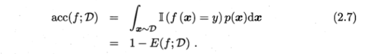

#### 查准率、查全率、$F_1$

**P、N描述预测结果，对应正反**

**T、F描述预测正误，对应真假**

- 查准率：P中T的比例

  

- 查全率（召回率）：找到的正例占总正例比例

  

- 一对矛盾的度量

**宏xx——对P、R平均**

- 宏查准率 macro-P（多个混淆矩阵）

  

- 宏查全率

  

- 宏F1

  

**微xx——对TP、FP等平均**

- 微查准率 micro-P

  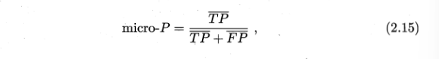

- 微查全率

  

- 微F1

  

#### P-R曲线

将样本按照“可能为正例的概率”由高到低排序，逐个把样本作为正例预测，每次计算查全率和查准率，得到P-R曲线

- 横坐标：查全率
- 纵坐标：查准率

比较学习器：

- 外侧P-R曲线对应的学习器更优——A优于C

- 曲线下面积

- 平衡点（BEP）：P=R

  A优于B

- F1度量：基于P和R的调和平均定义

  *与算数平均和几何平均相比，调和平均更重视较小值*
  $$
  \frac{1}{F1}=\frac{1}{2}\cdot(\frac{1}{P}+\frac{1}{R})
  $$
  

- $F_\beta$：F1的一般形式，加入对P、R的不同偏好（加权调和平均）
  $$
  \frac{1}{F_\beta}=\frac{1}{1+\beta^2}(\frac{1}{P}+\frac{\beta^2}{R})
  $$
  

  $\beta(\gt0)$：相对重要性

  - $\beta \gt 1$ 查全率影响更大
  - $\beta \lt 1$ 查准率影响更大

#### ROC与AUC

**ROC**

- 横轴：假正例率

  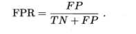

- 纵轴：真正利率

  

**由来**

根据学习器预测结果对样例排序

逐个把样本作为正例进行预测

ROC曲线图中的每个坐标点对应一种预测方案（某个预测阈值）

- 对角线(0,0) (1,1)——随机猜测模型（按等可能概率p将正例和反例预测为正，p值即为对应点的横纵坐标）
- 折线(0,0)-(0,1)-(1,1)——理想模型（所有正例排列在反例前面）

**基于有限样例绘制——近似ROC曲线**

1. 给定$m^+$个正例和$m^-$个反例，根据学习器的预测结果排序（按预测为正例的概率从大到小排列）
2. 分类阈值设置为最大，所有样例均预测为反例

   TPR=FPR=0，(0,0)点
3. 分类阈值依次设置为每个样例的预测值，即依次将每个样例划分为正例
4. 设前一个标记点为(x,y)

   若当前为真正例，则对应(x,y+$\frac{1}{m^+}$)，即真正利率增大$\frac{1}{m^+}$

   若当前为假正例，则对应(x+$\frac{1}{m^-}$,y)，即假正例率增大$\frac{1}{m^-}$
5. 线段连接相邻的点

**性能比较**

- 外圈的优于内圈的
- 面积（AUC）大的优于面积小的，估算方式：

  

  每个小矩形近似为小直角梯形

**AUC**

样本预测的排序质量，而**排序质量依赖于学习器的性能**

如前所说，面积最大的情况是——所有正例被正确的排列在反例前的理想模型，此时学习器的效果很好

**排序损失(loss)**

- f(+) < f(-)	1*罚分
- f(+) = f(-)    0.5*罚分

$$
AUC=1-\mathcal{l}_{rank}
$$

仿照loss的定义，可以认为AUC积分规则为：

- f(+) > f(-)	1*得分
- f(+) = f(-)    0.5*得分

**公式证明**

显然，在ROC曲线中，一条横线对应一个（或多个）负样本 $ x_{i}^{-} $ ， 一条竖线对应一个（或多个）正样本 $ x_{j}^{+} $ ， 而一条斜线则对应多个正负样本 $ x^{+}_{\ast},x^{-}_{\ast} $ ，且 $ f(x^{+}_{*}) = f(x^{-}_{\ast}) $ ，即样本的预测值相同。如下图所示：

其中 $ m_{i}^{+} $ 对应一个（或多个预测值相同的）正例，而 $ m_{j} $ 对应多个预测值相同的正负例 $ x^{+}_{\ast},x^{-}_{\ast} $

显然阴影部分的宽为 $ \frac{\sum_{x^{-}\in D^{-}} \parallel(f(x^{-}) = f(m_{j}))} {m^{-}} $

$ m_{i}^{+} $ 的纵坐标为 $ \frac{\sum_{x_{+}\in D^{+}}\parallel(f(x^{+})>f(m_{j}))}{m^{+}} $

$ m_{j} $ 纵坐标为 $ \frac{\sum_{x_{+}\in D^{+}}\parallel(f(x^{+})>f(m_{j}))}{m^{+}} + \frac{\sum_{x_{+}\in D^{+}}\parallel(f(x^{+})=f(m_{j}))}{m^{+}} $

于是阴影部分面积则为

$$
\frac{(\sum_{x^{-}\in D^{-}} \parallel(f(x^{-}) = f(m_{j})))\ast(\sum_{x^{+}\in D^{+}} (\frac{1}{2}\parallel(f(x^{+}) = f(m_{j}))+\parallel(f(x^{+}) > f(m_{j})))} {m^{-}m^{+}}
$$

令 $ D^{-}_{|f(D^{-})|} $ 表示预测值唯一的负例集合，即原负例集合中以预测值 $ f(x) $ 去重， 那么AUC值为：

$$
\sum_{m \in D^{-}_{|f(D^{-})|}}\frac{(\sum_{x^{-}\in D^{-}} \parallel(f(x^{-}) = f(m)))\ast (\sum_{x^{+}\in D^{+}} (\frac{1}{2}\parallel(f(x^{+}) = f(m))+\parallel(f(x^{+}) > f(m)))} {m^{-}m^{+}}
\\其中 \\ \sum_{m \in D^{-}_{|f(D^{-})|}} (\sum_{x^{-}\in D^{-}} \parallel(f(x^{-}) = f(m))) \ast \sum_{x^{+}\in D^{+}} \parallel(f(x^{+}) = f(m)) = \sum_{x^{+}\in D^{+}}\sum_{x^{-}\in D^{-}} \parallel(f(x^{+}) = f(x^{-}))
$$

而

$$
\sum_{m \in D^{-}_{|f(D^{-})|}} (\sum_{x^{-}\in D^{-}} \parallel(f(x^{-}) = f(m))) \ast \sum_{x^{+}\in D^{+}} \parallel(f(x^{+}) > f(m)) = \sum_{x^{+}\in D^{+}}\sum_{x^{-}\in D^{-}} \parallel(f(x^{+}) > f(x^{-}))
$$

于是

$$
AUC = \frac{1}{m^{+}m^{-}}\sum_{x^{+}\in D^{+}}\sum_{x^{-}\in D^{-}} (\parallel(f(x^{+}) > f(x^{-})) + \frac{1}{2}\parallel(f(x^{+}) = f(x^{-})))
$$

于是 $ AUC + l_{rank} = 1 $

#### 代价敏感错误率与代价曲线

**非均等代价**——为权衡不同类型的错误所造成的不同损失

**代价矩阵**

$cost_{ii}=0$

更关注代价比值

以上表中第0类为正例，第1类为反例，**代价敏感的错误率**

非均等代价下，ROC曲线不能直接反映学习器的期望总体代价

**代价曲线(cost curve)**

- 横轴：[0,1]（正例概率代价）

  

  p：样例为正例的概率
- 纵轴：归一化代价

  

  假反例率$FNR=1-TPR$

**绘制方法**

- ROC上一点对应代价平面上一条线段

  (TPR,FPR)——线段(0,FPR)-(1,FNR=1-TPR)
- 将ROC曲线上的每个点转化为代价平面上的一条线段
- 取所有线段的下界

**每条线段下的面积代表该条件下的期望总体代价**

**所有下界围成的面积为所有条件下学习器的期望总体代价**

### 比较检验

比较学习器性能存在的问题：

- 希望比较**泛化性能**，但实验评估的是在**某些**测试集上体现出来的性能
- 测试集上的性能和测试集的选择有关
- 机器学习算法本身包含随机性，相同参数在同一测试集上多次运行结果未必相同

*以错误率$\epsilon$为性能指标*

#### 假设检验

假设：对错误率分布的猜想

*假定测试样本是从样本总体分布中独立采样得到*

设学习器的泛化错误率$=\epsilon$，测试错误率$\hat{\epsilon}$，测试样本$m$个

测试样本中恰有$\hat{\epsilon}\times m$个被误分类

则该学习器将$m^{'}$个样本误分类，其余正确分类的概率$=\epsilon^{m^{'}}(1-\epsilon)^{m-m{'}}$

则其恰将$\hat{\epsilon}\times m$个样本误分类的概率为

也即：该学习器被测得测试错误率为$\hat{\epsilon}$的概率

$\lvert\epsilon-\hat{\epsilon}\rvert$越大，$P(\hat{\epsilon};\epsilon)$越小，**符合二项分布**，如下图

$m=10$，测得3个被误分类的概率最大

##### 二项检验

用**二项检验**检验$\epsilon\leq0.3$

> 假设$\epsilon\leq\epsilon_0$
>
> 拒绝域$\{\epsilon\gt\overline{\epsilon}\}$
>
> 在$1-\alpha$概率内能观测到的最大错误率：
>
> 
>
> （控制“在$\epsilon\leq\epsilon_0$成立的情况下错误的拒绝该假设/认为$\epsilon\gt\epsilon_0$（**第一类错误**——错杀好人）”的概率小于$\alpha$，只是这里“认为$\epsilon\gt\epsilon_0$”的概率符合二项分布）
>
> 满足上式的最大$\epsilon$使得第二类错误概率最小
>
> 式子左边对应于图2.6阴影部分
>
> 下面比较$\hat{\epsilon}$和拒绝域
>
> $1-\alpha$置信度下……

##### t检验

k个测试错误率，平均错误率$\mu$，方差$\sigma^2$

> 假设：$\mu=\epsilon_0$
>
> 
>
> 
>
> 

#### 交叉验证t检验

##### 成对t检验

基本思想：若两个学习器性能相同，则它们使用相同的训练/测试集（同一折）得到的测试错误率应相同

##### 5x2交叉验证

核心做法：5次2折实验，只计算第一次的均值，分别计算五次的方差，5词方差均值作为最终方差

#### McNemar检验

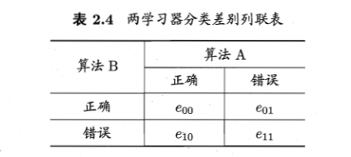

> 假设：两学习器性能相同，$\epsilon_{01}=\epsilon_{10}$
>
> 

大于临界值时拒绝原假设

#### Friedman检验和Nemenyi后续检验

==课本/ppt==

##### Friedman检验——F分布

多个算法参与比较

大于临界值时拒绝原假设

##### Nemenyi后续检验——Tukey分布

当“所有算法性能相同”的假设被拒绝时，进行后续检验区分算法

### 偏差与方差

偏差-方差分解：解释学习算法泛化性能

- 期望预测

  
- 方差

  

  方差度量了同样大小的训练集的变动导致的学习性能的变化，刻画**数据扰动**所造成的影响
- 噪声

  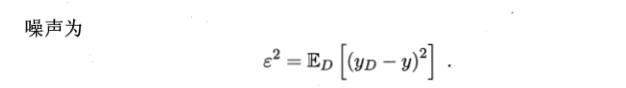

  噪声表达当前任务上任何学习算法所能达到的期望泛化误差的下界，刻画**学习问题本身**的难度
- 偏差

  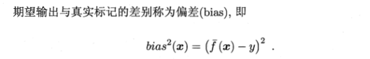

  偏差度量学习算法的期望预测与真实结果的偏离程度，刻画**学习算法本身**的拟合能力

上式仅在基于**均方误差**的**回归任务**中得以推导出。

**偏差-方差窘境**

## 线性模型

### 基本形式

$d$个属性描述的示例$\vec{x}=(x_1;x_2;…;x_d)$

$x_i$是示例在第$i$个属性上的取值

**线性模型**

通过属性的线性组合进行预测

$w$表达各属性在预测中的重要性

### 线性回归

**数据集**

$$
D=\{(\vec{x_1},y_1),(\vec{x_2},y_2),\ldots,(\vec{x_m},y_m)\}
$$

（示例，标记)

**离散属性**

若属性值间存在“序”的关系，可通过连续化将其转化为连续值（方可计算距离）

> 如：
>
> {高，低}$\to${1.0，0.0}
>
> {高，中，低}$\to${1.0，0.5，0.0}

若属性值间不存在序关系，k个属性值通常转化为k维向量（类似独热码编码）

> 如：
>
> {黄瓜，西瓜，南瓜}$\to${(0,0,1), (0,1,0), (1,0,0)}

#### 单属性

##### 模型建立

确定$w,b$——均方误差最小化，即**最小二乘法**

> 均方误差
>
> 
>
> 几何意义：欧氏距离

##### 最小二乘参数估计

是关于$w$和$b$的凸函数

#### 多元线性模型

##### 模型建立

参数向量（列向量）

$$
\hat{\vec{w}}=(\vec{w};b)=\pmatrix{w_1\\w_2\\\vdots\\w_d\\b}
$$

数据集属性矩阵

标记向量（列向量）

$$
\vec{y}=(y_1;y_2;\ldots;y_m)=\pmatrix{y_1\\y_2\\\vdots\\y_m}
$$

$$
\bold{X}\hat{\vec{w}}=\pmatrix{f(\vec{x_1})\\f(\vec{x_2})\\\vdots\\f(\vec{x_m})}
$$

##### 参数估计

求导方法：

讨论

- $\bold{X^{T}}\bold{X}$满秩或正定

  > 1. 正定一定满秩
  > 2. $\rank\{X^TX\}=\rank\{XX^T\}=\rank\{X^T\}=\rank\{X\}=d+1$，于是**X是列满秩**的
  >

  

  

  
- 其他

  

  根据学习算法的归纳偏好选择作为输出的解，常见的做法是引入正则项

详细推导见==公式详解==

#### 变形

##### 对数线性回归

试图让$\exp\{\vec{w}^{T}\vec{x}+b\}$逼近$y$

实际求的是输入空间到输出空间的非线性函数映射

$$
样例\xrightarrow[线性映射]{f(x)}预测值\ln{y}\xrightarrow[非线性关系]{}与真实标记建立联系
$$

##### 广义线性模型

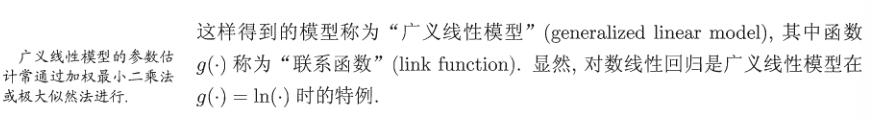

### 对数几率回归

利用广义线性模型，找一个单调可微函数将分类任务的真实标记和预测值联系起来

#### 二分类任务

##### 模型建立

**Heaviside函数/单位阶跃函数（unit-step function)**

但不连续，找近似替代函数

**对数几率函数(logistic function)/对率函数**

- 是一种Sigmoid函数，输出为接近0或1的值，且在z=0附近很陡
- 任意阶可导
- 凸函数

带入

得到

优点

- 对分类问题不需假设数据分布，而是直接对分类的可能性进行建模
- 不仅给出类别预测，而且给出近似概率预测

##### 参数估计

==书==（没看懂。。）

**先验概率（prior probability）：**指根据以往经验和分析。在实验或采样前就可以得到的概率。

**后验概率（posterior probability）：**指某件事已经发生，想要计算这件事发生的原因是由某个因素引起的概率。

### 线性判别分析（Linear）

基本思想：给定训练样例集，设法将样例投影到一条直线上，使得同类样例的投影点尽可能接近、异类样例投影点尽可能远离

面对新样本时：将其投影到同样的这条直线上，再根据投影点的位置来确定新样本的类别

#### 二分类

数据集$D=\{(\hat{\vec{x_i}},y_i)^{m}_{i=1},y_i\in\{0,1\}\}$

第$i$类示例集合 $\bold{X_i}$、均值向量$\vec{\mu_i}$、协方差矩阵$\bold{\Sigma_i}$

投影直线$w$

投影中心$w^T\mu_0$、$w^T\mu_1$

协方差$w^T\Sigma_0 w$、$w^T\Sigma_1 w$

直线是一维空间，故上面四个值都是实数

- 同类样例投影点尽可能近$\to$同类样例投影点协方差尽可能小

  即$w^T\Sigma_0 w+w^T\Sigma_1 w$尽量小
- 异类样例投影点尽可能远$\to$类中心之间的距离尽可能大

  即$||w^T\mu_0-w^T\mu_1||_2^2$尽可能大
- 最大化目标

  
- 类内散度矩阵

  

  对称矩阵
- 类间散度矩阵

  
- 最大化目标化为——$S_b与S_w$的**广义瑞利商**

  
- 求解$w$

  $w$是解，则$w$的任意常数倍也是解

  

  等价于

  

  ==拉格朗日乘子法==

  

  

  

  

  ==同先验==？

#### 多分类

N个分类，第i类示例数为$m_i$

- 全局散度矩阵

  

  $\hat{\mu}$是所有示例的均值向量
- 类内散度矩阵

  

  其中

  为每个类别的散度矩阵

  于是有
- 类间散度矩阵

  

使用上述$S_b,S_w,S_t$中的任意两个即可以实现多分类LDA

常见的，采用优化目标

（3.45）的证明：

### 多分类学习

一般的，多分类拆分成多个二分类，再对二分类的预测结果进行集成获得最终的多分类结果

#### 拆分策略

##### 一对一 OvO

N个类别两两配对，产生$\frac{N(N-1)}{2}$个二分类任务

最终预测结果可通过投票产生/根据分类器的预测置信度集成

##### 一对其余 OvR

每次将一个类作为正例，其他作为反例，训练N个分类器

测试时

- 若仅有一个分类器预测为正类，则该类作为分类结果
- 若多个分类器预测为正类，则考虑各分类器预测置信度最大的作为分类结果

比较：

- OvO存储开销和测试时间开销较OvR大
- 但OvR的每个分类器训练时均使用全部训练样例，而OvO每次只用到两个类别的样例，因此类别很多时，OvO训练开销通常更小

##### 多对多 MvM

每次若干个类作为正类，若干个类作为反类

OvO和OvR都是MvM的特例

正反类构造需要特殊设计

常用MvM技术——**纠错输出码(ECOC)**

###### ECOC

**编码矩阵**

用于类别划分

- 二元码：正类/反类
- 三元码：正类/反类/停用类

> 海明距离：两个码对应位置不同的个数；与停用类不同记为0.5

一般，对同一个学习任务，ECOC编码越长，纠错能力越强

> 假设任意两个类别之间最小的海明距离为d，那么此纠错输出码最少能矫正$\frac{d-1}{2}$位的错误

但编码越长，需训练的分类器越多，计算、存储开销越大

有限类别数，可能的组合数目是有限的，码长超过一定范围后失去意义

对同等长度的编码，理论上，任意两个类别之间的编码距离越短，则纠错能力越强

**一个好的ECOC应满足**

- 行分离：任意两个类别之间的codeword足够大
- 列分离：任意两个分类器$f_i$，$f_i$的输出应相互独立，无关联。这一点可以通过使分类器$f_i$编码与其他分类编码的海明距离足够大实现，且与其他分类**编码的反码的海明距离也足够大**

  > 如果两个分类器的编码类似或者完全一致，很多算法（比如C4.5）会有相同或者类似的错误分类，如果这种同时发生的错误过多，会导致纠错输出码失效。
  >
  > 解释：
  >
  > 若增加两个类似的编码，那么当误分类时，就从原来的1变成3，导致与真实类别的codeword海明距离增长。极端情况，假设增加两个相同的编码，此时任意两个类别之间最小的海明距离不会变化依然为$d$，而纠错输出码输出的codeword与真实类别的codeword的海明距离激增（从1变成3）。所以如果有过多同时发出的错误分类，会导致纠错输出码失效。
  >
  > 两个分类器的编码也不应该互为反码，因为很多算法（比如C4.5，逻辑回归）对待0-1分类其实是对称的，即将0-1类互换，最终训练出的模型是一样的。也就是说两个编码互为补码的分类器是会同时犯错的。同样也会导致纠错输出码失效。
  >

  对于$k$种类别分类，去除反码/全0/全1，剩下$2^k-1$种可行编码

**构造方法**

对$3\leq k\leq7$，构造长为$2^{k-1}-1$的编码

第1行：全1

第2行：$2^{k-2}$个0，后跟$2^{k-2}-1$个1

第3行：$2^{k-3}$个0，后跟$2^{k-3}$个1，后跟$2^{k-3}$个0，后跟$2^{k-3}-1$个1

第$i$行：$2^{k-i}$个0和$2^{k-i}$个1交替，最后一组少一个1

==NP问题==

最终分类性能受多方面的影响：

- 编码的理论纠错性能
- 二分类子问题难度

### 类别不平衡问题

可能导致类别不平衡的原因：

- 拆分多分类时（即使原本没有不平衡），OvR、MvM得到的二分类可能不平衡

  

三类做法

1. 欠采样：对训练集中的反例“欠采样”，即去除一些反例使得正反例数目接近（假设不平衡时反例>正例），**随机丢弃可能丢失重要信息**

   代表算法：利用集成学习机制，将反例划分成若干个集合供不同学习器使用，使得全局来看不丢失信息
2. 过采样：对训练集中的正例“过采样”，**不是重复采样**

   代表算法

   - SMOTE——对训练集中的正例进行插值产生额外的正例
   - MIXUP数据增强
3. 阈值移动：基于原始训练集学习，将式(3.48)嵌入决策过程

   **再放缩策略**

   “训练集是真实样本总体的无偏采样”并不总成立

   未必能有效基于训练集观测几率来推断出真实几率

   **线性分类器**

   

   

   

   实际希望比较

   $$
   \frac{y}{1-y}\times\frac{m^-}{m^+}和1
   $$

   ==$y^{'}$是否有用 或者有含义呢==

   由于算法本身的实现方式不变（使用的分类器基于类别平衡分类决策规则），只能对预测值做变换

   即将(3.48)得到的作为最终预测值

   **特别的**，*将(3.48)中的$\frac{m^-}{m^+}$换成$\frac{cost^+（正例误分）}{cost^-（反例误分）}$即是代价敏感学习*

评价：

- 欠采样的时间开销远小于过采样

## 决策树

### 基本流程

叶结点——决策结果

根结点——样本全集

其他结点——属性测试

根结点到叶结点的路径——一个判定测试序列

决策树学习目的——产生一棵泛化能力强的决策树

决策树桩：只有一层划分的决策树

- l2-l3：第一个return——某个子集只含一类样本
- l14：对于离散属性，每个属性不重复使用；划分次数通常不超过属性个数
- l5：所有属性均作为划分依据之后，A=$\phi$，此时无法再划分剩下样本；或者剩下的样本不属于同一类，但在A中剩下属性上表现相同，也无法划分剩下样本

  ——>少数服从多数，不唯一时任选一个（**利用当前结点的后验分布**）
- l11-l12：若某个属性对应子分支为空（可能因为没有收集到相应的样本），采用盲猜的做法，将对应叶结点标记为D中数量最多的类别（**全体样本的分布作为当前结点的先验分布**）

### 划分选择

如何选择最优划分属性

——随着划分进行，希望决策树的分支所包含的样本尽可能属于同一类

#### 信息增益

**信息熵**：度量样本集合纯度的常用指标

> -log：凸函数
>
> 

- 最大值

  

  

  各样本均分，样本纯度最低

  > 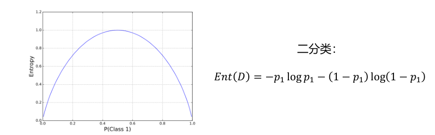
  >
  > $p_1=0.5$取最大
  >
- 最小值：0

  

  所有样本属于同一类，样本纯度最高

**信息增益**

衡量变量之间的**互信息$I(X,Y)$**，$H(Y)=Ent(Y)$

互信息描述的是：给定变量Y情况下，导致变量X的信息熵的下降值

- 若X、Y相互独立，$\log$项为0，互信息为0
- 否则互信息>0

由此定义**信息增益**：

解释：

离散属性a有V个可能取值$\{a^i,i=1,2,\cdots,V\}$

用a对样本集D进行划分，产生V个分支结点$\{D^i,i=1,2,\cdots,V\}$

(4.2)中部分是各个分结点子集信息熵（条件熵）的加权平均

$Ent(D^V)$越小，子结点纯度越高，$Gain(D^V)$越大——>使用属性a进行划分获得的“纯度提升”越大

l8选择最优划分属性

*特别的*，若给每个样本一个不同的编号，以编号作为划分属性，得到信息增益接近于1——每个编号下只有一个样本，纯度已达最大，但这样的划分不具有泛化能力

——> **信息增益准测对可取值数目较多的属性有所偏好**

#### 增益率

**C4.5决策树算法**减少上述偏好的不利影响

使用“增益率(Gain ratio)”而不是“信息增益”选择最优划分属性

**增益率**

**增益率准则对可能取值数目较少的属性有所偏好**

**C4.5**的做法——启发式：

1. 从候选划分属性中找出信息增益高于平均水平的属性
2. 进一步选出增益率最高的

#### 基尼指数

**CART决策树**使用**基尼指数**选择划分属性

##### 数据集的基尼集

**基尼值**度量数据集纯度

**基尼值和Ent的关系**

##### 属性a的基尼指数

基于上述关系和

（$Ent(D)$和数据集的属性划分没有关系，==是为了调整单调性（？）==）

给出**基尼指数**的定义：

选择最优化划分属性`

### 剪枝处理

——应对过拟合的主要手段

#### 判断泛化性能是否提升

见**2.2 性能评估**

*本节：留出法*

*判断依据：划分在验证集上的精度*

#### 预剪枝

决策树生成过程中，每个结点划分前判断：

- 若划分不能提高决策树的泛化性能，不再划分，当前结点标记为叶结点，少数服从多数

**优点**

- 降低过拟合风险
- 减少决策树训练时间开销和测试时间开销

**缺点**

- 带来欠拟合风险：基于**贪心**本质禁止泛化性能没有提高的分支展开，但基于这些分支的后续划分可能带来性能提高

#### 后剪枝

生成完整决策树后，自底向上考察非叶结点

- 若将非叶结点的子树替换为叶结点能提高泛化性能，则替换

> 
>
> 

后剪枝策略通常比预剪枝保留更多的分支

**优点**

- 欠拟合风险小
- 泛化性能往往优于预剪枝决策树

**缺点**

- 训练时间开销大于未剪枝和预剪枝

### 连续与缺失值

#### 连续值处理

连续属性离散化

**C4.5**采用**二分法**

连续属性$a$，样本集$D$，$a$在$D$上只会出现有限个取值，设为$n$

从小到大排列并选取划分点$t$，将$D$分为$D^+_t$和$D^-_t$

**选取划分点t**

取相邻属性值的中点构成

类比离散情形，有

实际操作中可将$D$中出现的不大于(4.8)选出的最大t的最大属性值作为最终的划分值，使得最终决策树使用的划分点在训练集中都出现过

**即：相比于离散属性，连续属性再得到信息增益的同时需要求出划分点**

**离散属性可以重复作为划分依据**

#### 缺失值处理

随机缺失/非随机缺失

##### 选择划分属性

样本集$D$，$\tilde{D}$为$D$在属性$a$上没有缺失值的子集

对$\tilde{D}$进行两种划分

- 按在属性$a$上的取值：$\tilde{D}^v$为$\tilde{D}$在属性$a$上取值为$a^v$的样本子集

  
- 按样本最终分类：$\tilde{D}^k，k=1,2,\cdots,|\mathcal{Y}|$

  

  

  *决策树学习开始阶段，根结点各样本权值初始化为1*

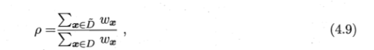

——属性a无缺失值样本所占比例

——无缺失值样本中第$k$类所占比例

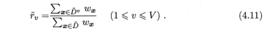

——无缺失值中属性$a$取值为$a^v$的样本所占比例

将无缺失值下的信息增益推广为

其中

$\rho$使得无缺失集上的信息增益减小为一定比例——结合下面的划分方式可以理解 划分对属性值缺失的样本没有贡献（存在于各个子类中，仍导致不纯）

##### 划分含缺失值样本

- 样本属性值已知：划分到对应子结点，权值保持
- 样本属性值缺失：将样本划入所有子结点，但权重不同

  在属性值为$a_v$的结点中权值变为$\tilde{r}_v·w_x$

  **即：让样本以不同概率划入不同子结点，“概率”取各属性值在$\tilde{D}$中的出现频率**

### 回归树

- 叶子结点标记——均值；中位数
- 优化目标——如：均方误差

  - 划分前误差

    求c，s.t.

    
  - 划分后误差

    

  **理解**：划分前$D$只有一个c计算整个均方误差，划分后每个子集$D^v$有自己的$c^v$分别计算均方误差

==若平方换成绝对值——c=中位数；求中位数时间复杂度：O(n)==

- 最优划分属性

  

### 多变量决策树

属性——坐标轴

d个属性描述——d维坐标空间中的一个数据点

样本分类——在坐标空间中寻找不同类样本之间的分类边界

决策树形成的分类边界特点：轴平行（每段与坐标轴平行）

边界复杂时预测时间开销大

**多变量决策树**——实现斜划分

非叶结点变为对属性的线性组合进行测试

权重$w_i$和$t$可在该结点所含的样本集和属性集上学习得到

==离散属性 决策树复杂度==

## 神经网络

### 神经元（neuron）模型

**神经网络**：由具有适应性的简单单元组成的广泛并行互连的网络，它的组织能够模拟生物神经系统对真实世界物体所做出的交互反应

#### M-P神经元模型

1. 输入：神经元收到n个其他神经元传递的**带权重**输入信号
2. 处理：将总输入与神经元的阈值比较
3. 输出：通过**激活函数**处理产生输出

#### 激活函数

##### 阶跃函数

一种理想的激活函数

- 将输入值映射为$0$或$1$
- 1——神经元兴奋
- 0——神经元抑制

**缺点**：不连续、不光滑，==不适应梯度下降法==

##### Sigmoid函数/挤压函数

许多神经元按一定的层次结构连接起来——神经网络

将神经网络看作一个数学模型：

由若干$y_j=f(\sum_{i}w_ix_i-\theta_j)$函数相互嵌套得到。

##### softmax

见**BP算法-多分类问题**下

深度学习

##### tanh

##### ReLU

$$
f(x)=\max(0,x)
$$

支持稀疏表示，只有一部分神经元被激活

##### Leaky ReLU

##### Maxout

##### ELU

### 感知机与多层网络

#### 感知机

##### 定义

由两层神经元组成，只有一层功能神经元

- 输入层：接收外界输入信号，传递给输出层
- 输出层：M-P神经元（阈值逻辑单元）

##### 实现逻辑或、与、非

*取$y=f(\sum_{i}w_ix_i-\theta)$中$f$为阶跃函数*

- 与

  $$
  y=f(1\cdot x_1+1\cdot x_2 - 2)
  $$
- 或

  $$
  y=f(1\cdot x_1+1\cdot x_2 - 0.5)
  $$
- 非

  $$
  y=f(-0.6\cdot x_1+0\cdot x_2 + 0.5)
  $$

##### 参数更新

利用经验的方法更新参数（而不是梯度下降）

- 参数统一

  将阈值$\theta$看作一个固定输入为$-1.0$的“哑结点”，对应连接权重$w_{n+1}$是真正的阈值
- 学习规则

  

  $\eta \in (0,1)$：学习率

  - 学习目标：减小$y$和$\hat{y}$差值
  - 预测正确时，感知机不变

##### 学习能力

只有输出层神经元进行激活函数处理（只有一层功能神经元），学习能力有限。

若两类模式线性可分（可以用线性超平面划分），则感知机学习过程一定收敛；否则将发生震荡，$w$难以稳定（*e.g. 异或*）。

#### 多层功能神经元

——为了解决非线性可分问题

- 输入层
- 隐含层（隐层）
- 输出层

输出层和隐含层神经元都是有激活函数的功能神经元

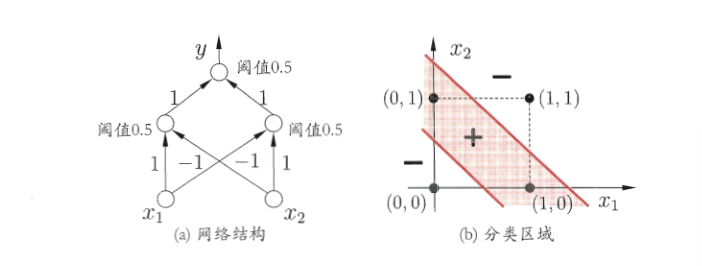

##### 多层前馈神经网络

multi-layer feedforward neural networks

**定义**：每层神经元与下一层神经元**全互联**,；神经元之间不存在**同层连接**和**跨层连接**

**前馈**：网络拓扑结构上不存在环或回路

**工作方式**：输入层只接收外界输入，不进行函数处理；隐含层和输出层神经元对信号加工

**学习**：根据训练数据调整神经元之间的**连接权**和每个功能神经元的**阈值**

**表示能力**：

若多层前馈神经网络的隐层有

- 足够多（隐藏）神经元
- 任意“挤压”性质的激活函数

则多层前馈神经网络可以以任意精度逼近**有界闭集**上的任意**连续**函数

### 误差逆传播算法（BP算法）

最成功的训练神经网络算法

#### 模型建立

- 离散属性需要先进行处理：若属性值间存在“序”关系，则可以进行连续化；否则转化为$k$维向量，$k$为属性值数

训练集$D=\{(\vec{x}_1,\vec{y}_1),(\vec{x}_2,\vec{y}_2),\dots,(\vec{x}_m,\vec{y}_m)\}$，$\vec{x}_i\in\mathbb{R}^d$（$d$维特征向量），$\vec{y}_d\in\mathbb{R}^l$（$l$维输出向量）

隐层第$h$个神经元阈值：$\gamma_h$

输出层第$j$个神经元阈值：$\theta_j$

$$
\vec{x}\xrightarrow[加权和]{}隐层神经元输入\alpha_i\xrightarrow[隐层激活函数]{}隐层输出b_i\\
\xrightarrow[加权和]{}输出层神经元输入\beta_j\xrightarrow[输出层激活函数]{}输出y_j,\vec{y}
$$

共$(d+l+1)q+l$个参数需要确定

#### BP算法

激活函数均选择$Sigmoid$函数，误差函数选择均方误差

> $$
> \frac{\partial E_K}{\partial \hat{y}_j^k}=\hat{y}_j^k-y_j^k\\
> \frac{\partial \hat{y}_j^k}{\partial \beta_j}=f^\prime(\beta_j-\theta_j)
> $$

参数更新规则：

更新方向：目标的负梯度方向

##### $\Delta w_{hj}$

求更新公式：

$\Delta w_{hj}$先影响到第$j$个输出神经元的输入值$\beta_j$，再影响到其输出值$\hat{y}_j^k$，继而影响$E_K$

（链式法则）

> Sigmoid函数性质：
> 

由公式(18)

$\Rightarrow$

##### $\Delta \theta_j$

##### $\Delta v_{ih}$

按照箭头方向思考链式法则的式子

**求和符号**：$b_h$通过影响**每个**$\beta_j$最终影响$E_k$

##### $\Delta \gamma_h$

##### 参数更新总结

输出层参数更新用到：

- $g_j=\hat{y}(1-\hat{y})(y-\hat{y})$——只和输出层误差有关

  **输出层神经元梯度项**

- $b_h$——前一层隐层神经元输出

隐层参数更新用到：

- $e_h=b_h(1-b_h)\sum_{j=1}^{l}w_{hj}g_j$——当前隐层神经元输出、后一层输出层权重x输出层误差的函数

  **隐层神经元的梯度项**

- 输入$x_i$

学习率$\eta$：控制更新步长，常设置为0.1

不同层功能神经元可以使用不同的学习率（5.11、5.12 || 5.13、5.14）

##### 标准BP算法

1. 样例输入到输入层神经元
2. 产生输出结果
3. 计算输出层误差
4. 误差逆向传播到隐层神经元
5. 调整参数
6. 迭代循环至误差足够小、防止过拟合

但上图中的算法每次只针对一个训练样例更新参数

##### 累积误差逆传播算法

**训练目标**

最小化训练集上的累计误差

**对比**

- 标准BP：
  - 参数更新频繁
  - 对不同样例的更新结果可能相互抵消
  - 一般需要更多的迭代次数

- 累积BP：
  - 读取整个训练集一遍后才对参数更新
  - 累积误差下降到一定程度后，进一步下降非常缓慢

#### 过拟合

缓解方法

- 早停

  训练集误差降低，验证集误差开始升高时停止训练

- 正则化

  在误差目标函数中增加一个用于描述网络复杂度的部分，如：连接权与阈值的平方和。

  

#### 多分类问题

##### 多分类损失-交叉熵

期望输出：$\vec{d}$，one-hot

实际输出：$\vec{y}$

均方误差：$\frac{1}{2}\sum_j(y_j-d_j)^2$

**Cross Entropy（交叉熵）**

熵：$H=-\sum_{i=0}^{n}p(x_i)log(p(x_i))$

$p(x_i)$: $x_i$出现概率

KL散度（可以理解为相对熵）：
$$
D_{KL}(p,q)&=&\sum_{i=0}^{n}p(x_i)log(\frac{p(x_i)}{q(x_i)})\\&=&-H-\sum_{i=0}^{n}p(x_i)log(q(x_i))
$$
样本真实分布已知，真实分布的熵固定不变，只关注后面求和部分，即“交叉熵”
$$
Loss=-\sum_jd_jlogy_j
$$
实际情况中，$\vec{d}$只有一位为1，因此，对一个属于$j$类的样本$Loss=-lna_j$

##### softmax

$$
f(e_i)=\frac{e^i}{\sum_je^j}
$$

softmax得到的输出向量满足：各维度和为1，可以理解为概率

###### 溢出问题（作业）

###### 求梯度

**求导**

在梯度下降优化参数时，链式法则第一步需要对softmax求导

eg. 

*注意：这里黄色框内为一层功能神经元*

假设真实输出为（1，0，0，0），则$Loss=-lna_4$
$$
\frac{\partial{Loss}}{\partial{w_{41}}}&=& \frac{\partial{Loss}}{\partial{a_4}} \frac{\partial a_4}{\partial z_4}\frac{\partial z_4}{\partial{w_{41}}}\\
&=&-\frac{1}{a_4} \frac{\partial a_4}{\partial z_4}x_1
$$
下面求$\frac{\partial a_j}{\partial z_i}$

**梯度计算**（作业）

### 全局最小与局部极小

参数寻优方法

- 梯度下降法：沿负梯度方向

- 跳出局部极小：

  - 多组不同参数值初始化多个神经网络，最终取误差最小的

  - 模拟退火技术

    每一步以一定概率接受比当前解更差的结果；每步迭代中，接受“次优解”的概率随着时间的推移而逐渐降低，从而保证算法稳定性

  - 随机梯度下降

    在计算梯度时加入随机因素，使得即便在局部极小点，计算出的梯度仍可能不为0

- 遗传算法

### 其他神经网络算法

==书==

#### RBF网络

#### ART网络

竞争型学习

- 竞争方式：eg. 输入向量与识别层神经元对应模式类的代表向量之间的距离
- 当最大相似度大于识别阈值时，当前输入样本被归为该类；否则新增一个识别层神经元，代表向量为当前输入向量
- 更新网络连接权：使得胜者在面对相似样本时计算出的相似度更大

**性能影响因素**：识别阈值

**优点**：

- 缓解了“可塑性-稳定性窘境”；

- 可以进行增量学习（批量更新）/在线学习（一个样例一更新）

  面对新样例对已训得的模型更新，而不重新训练整个模型

#### SOM网络——自组织映射网络

竞争学习型无监督神经网络

- 高维输入数据映射到低维空间，保持数据在高维空间的拓扑结构——高维中相似的样本点映射到网络输出层中的临近神经元

  

#### 级联相关网络

结构自适应网络

- 级联：建立层次连接的层次结构
- 相关：最大化新神经元的输出与网络误差之间的相关性

训练较快，但数据较小时容易陷入过拟合

##### Elman网络

递归神经网络：允许网络中出现环形结构

可以处理与时间有关的动态变化

##### Boltzmann机

递归神经网络

基于能量的模型

- 显层：表示数据的输入与输出
- 隐层：数据的内在表达

### 深度学习

增加隐层的数目比增加隐层神经元数目更有效，前者增加了激活函数的嵌套层数

特征学习/表示学习

**概述**

靠近输入的特征（low level）中往往没有语义信息，多为线性变换，描述边缘特征

低级特征组合出高级特征

……

——>样本——坐标空间中的一个点

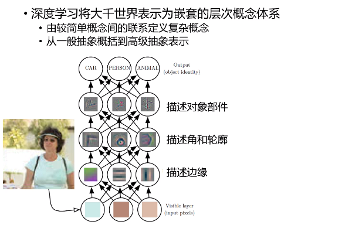

传统cv抽取的特征多为低级特征

#### 深度神经网络

- 卷积神经网络：保留矩阵的信息（压扁成向量会丢失信息）

  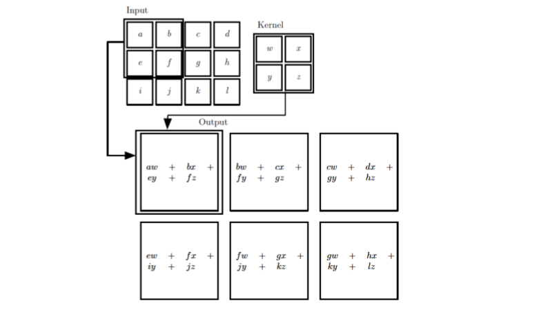

  - 参数在卷积核上，卷积核平移；相比于前馈神经网络，参数量急剧下降

  - 多个不同卷积核——>多个不同输出

#### 预训练+微调

预训练：无监督逐层训练

#### 权共享

一组神经元使用相同的连接权

在CNN中使用

每组神经元（每个“平面”）用相同的连接权

#### 微调

## 支持向量机

### 间隔与支持向量机

问题：分类问题中存在多个划分超平面时，应该去找哪一个？

- $\vec{w}=(w_1;w_2;\dots;w_d)$ 法向量，决定超平面的方向

- $b$ 位移项，决定超平面和原点之间的距离

- 样本空间中的任意点$\vec{x}$到超平面$(\vec{w},b)$的距离
  $$
  r=\frac{|{\vec{w}^T\vec{x}}+b|}{||w||}
  $$

- 支持向量

  到超平面最近、使得(6.3)等式成立的几个训练样本点

- 间隔

  两个异类支持向量到平面的距离之和（由距离计算式和(6.3)可得）
  $$
  \gamma=\frac{2}{||w||}
  $$

- 

### 对偶问题

解(6.5)(6.6)

#### 前置知识

##### 凸优化问题

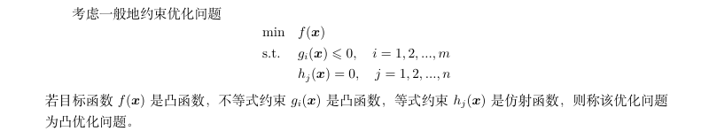

- 线性函数 是 过原点的仿射函数（$\alpha=1 \& \beta=0$）

##### KKT条件

##### 拉格朗日对偶函数

**对偶函数性质**

- 无论优化问题是否是凸优化的，对偶函数恒为凹函数

- 

  

  **推导**

  

##### 拉格朗日对偶问题

希望得到最好下界——

对偶问题始终可以化成凸优化问题

设对偶问题的最优值为$d^*$

- $d^*\leq p^*$ 弱对偶性

- $d^*=q^*$ 强对偶性

  $\Rightarrow$主问题最优下界，即最优解

- Slater条件

  若主问题是凸优化问题，且可行域中至少有一点使得不等式约束严格成立，则强对偶性成立

  此时将拉格朗日函数分别对原变量和对偶变量求导，另导数等于0，即得到原变量和对偶变量的关系

##### 二次规划——QP

目标是二次函数

约束条件是线性不等式

#### 求解step1——转化为对偶问题

拉格朗日函数：

- $\alpha_i \ge 0$，且$\frac{1}{2}||w||^2$和$1-y_i(\vec{w}^Tx_i+b)$均是关于$w$和$b$的凸函数

  $\Rightarrow $（6.8）也是凸函数

- 凸函数极值点就是最值点，一阶导为0即为最小值点

  $\Rightarrow$将上面的等于0时的取值带入(6.8)得到最小值==下确界

  因此可以求对偶函数为：

  

  对偶问题为(6.11)：

  

  约束条件

  

**作上述转化的原因**

对偶问题中解出的$\alpha_i$是原问题的拉格朗日乘子，对应训练样本$(\vec{x}_i,y_i)$

##### 梳理总结

原问题：

拉格朗日函数：

其中$f(\vec{x})=\vec{w}^T\vec{x}+b$

约束条件改写为

对偶问题：

(6.6)满足Slater条件，故最优解满足KKT条件

数量关系：

原拉格朗日函数对原变量求导

于是

再考虑(6.13)式的条件：

- 对任意训练样本有

- 前者：样本出现在(6.12)求和中
- 后者：

$\Rightarrow$**训练完成后，大部分样本不需要保留，最终模型只与支持向量有关**

#### 求解step2——求解对偶问题

 二次规划问题

**SMO算法**

只要选取的$\alpha_i$和$\alpha_j$中有一个不满足KKT条件，目标函数就会在迭代后减小

KKT违背程度越大，变量更新后可能导致目标函数减幅越大

SMO先选取违背KKT条件程度最大的变量

第二个变量选取使目标函数减小最快的变量

采用**启发式**：使选取两个变量所对应的样本之间的间隔最大

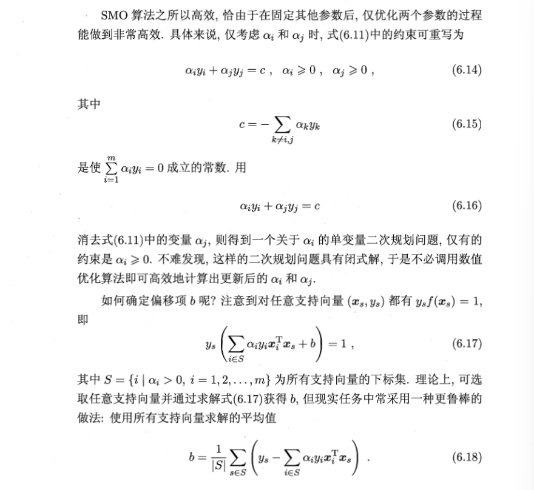
$$
b=\frac{1}{|S|}\sum_{s\in S}(\frac{1}{y_s}-\sum_{i\in S} \alpha_iy_i\vec{x_i}^T\vec{x_s})
$$
==????==

### 核函数

#### 非线性映射

训练样本非线性可分时，可以将样本从原始空间映射到一个更高维的特征空间，使得样本在这个特征空间内线性可分

**若原始空间是有限维的，即属性数有限，则一定存在一个高维特征空间使样本可分**

映射后$\vec{x}$的特征向量：$\phi({\vec{x}})$

特征空间中划分超平面的模型：$f({\vec{x}})=\vec{w}^T\phi(\vec{x})+b$

- 特征空间的维数可能很高/无穷维，$\phi({\vec{x_i}})^T\phi(\vec{x_j})$难以计算

#### 核技巧 核函数

**核技巧**

$\Rightarrow$模型最优解可以通过训练样本的核函数展开——支持向量展式

#### 核函数

- 对于一个半正定核矩阵，总能找到一个对应的映射$\phi$

  即：任何一个核函数都隐式的定义了一个特征空间——“再生核希尔伯特空间”（RKHS）

- 基本经验：文本数据通常采用线性核，情况不明时可先尝试高斯核

也可以通过函数组合得到核函数

### 软间隔与正则化

现实任务中往往很难找到合适的核函数使得训练集再特征空间中线性可分；

且可能线性可分实际是过拟合造成的

#### 软间隔

- 硬间隔：所有样本必须划分正确

- 软间隔：允许某些样本不满足约束

  在最大化间隔的同时，不满足约束的样本应尽可能少

  

  优化目标：

  

  

  $\mathscr{l}_{0/1}$数学性质不好

  - 非凸
  - 非连续

  替代损失：

  通常是凸的连续函数

  

  

##### hinge损失

**软间隔支持向量机**

每个松弛变量对应一个样本，表示该样本不满足约束(6.28)的程度

**求解（6.35）**

二次规划问题

拉格朗日函数：

拉格朗日对偶函数

约束条件

对偶问题

**对比硬间隔下对偶问题**

区别：$\alpha_i$有上界

KKT条件

对任意样本

- $\alpha_i=0$，不对$f(\vec{x})$产生影响
- $\alpha_i\gt0$，$y_if(\vec{x_i})=1-\xi_i$，支持向量
- 若$\alpha_i\lt C$，则$\mu_i \gt 0$，由KKT条件，$\xi_i=0$，样本恰好落在最大间隔边界上
- 若$\alpha_i= C$，则$\mu_i = 0$
  - 若$\xi_i\le 1$，样本落在最大间隔内部
  - 若$\xi_i\gt 1$，样本被错误分类

**软间隔支持向量机模型最终只与支持向量有关，hinge损失保持了稀疏性**

##### 对率损失

若用对率损失，几乎得到对率回归模型

==说明==

上式变形如下：

对数几率回归常用1和0表示正例和反例，而支持向量机中常用+1和-1表示

若将上式改为+1和-1表示正例和反例，则有

支持向量机与对率回归的优化目标相近，通常性能相当

- 对率回归输出有概率意义，而支持向量机没有

- 对率回归可以直接用于多分类任务，支持向量机需推广

- hinge损失保持稀疏性，对率损失是光滑的单调递减函数，不能导出类似支持向量的概念

  对率回归的解依赖于更多的样本，预测开销更大

##### 不同损失函数

使用不同损失函数替代得到的模型共性：

优化目标的第一项描述划分超平面的“间隔”大小

另一项描述训练集上的误差：

一般形式：

- $\Omega(f)$

  结构风险：描述模型f的某些性质

- $\sum_{i=1}^m \mathscr{l}(f(\vec{x_i}),\vec{y_i})$

  经验风险：描述模型与训练数据契合程度

- C

  对两者进行折中

从经验风险最小化的角度看，结构风险描述了希望获得具有何种性质的模型（如：复杂度较小的）

有助于削减假设空间，降低最小化训练误差的过拟合风险

从这个角度，(6.42)是正则化问题——罚函数

- $\Omega(f)$：正则化项，可以认为是提供了模型的先验概率

  $L_p$范数是常用的正则化项

  $L_2$范数倾向于各分量取值均衡，非零分量尽量稠密

  $L_0$范数和$L_1$范数倾向于$\vec{w}$尽量稀疏，非零分量尽量少

- C：正则化常数

### 支持向量回归

SVR问题可形式化为：

==解释==

拉格朗日函数：

KKT条件

**每个不等式约束对应一个拉格朗日乘子，且要求乘积均为0**

前两个式子，**括号内=0**代表样本落在间隔带外

当样本落在间隔带内时，$\alpha_i$和$\hat{\alpha_i}$都为0

样本$(\vec{x_i},y_i)$只能处在间隔带的一侧，即不能同时成立，**因此$\alpha_i$和$\hat{\alpha_i}$至少有一个为0**

进而，由后两个式子可知，$\alpha_i=0$时，$\xi_i=0$，即$\xi_i$和$\hat{\xi_i}$至少有一个为0

由(6.47)得SVR的解为

此时前两个式子的括号部分有且仅有一个为0，支持向量落在间隔带之外

- 若$0\lt \alpha_i\lt C \Rightarrow \xi_i=0$

  

  

#### 非线性特征映射

(6.47)变为

SVR表示为

### 核方法

#### 核化 非线性拓展

>  线性判别分析——LDA：
>
> 

核线性判别分析——KLDA

学习目标：

- 用$\kappa(\vec{x},\vec{x_i})=\phi(\vec{x_i})^T\phi(\vec{x})$隐式表示映射$\phi$和特征空间$\mathbb{F}$，==相应的，后面引入的$\hat{\mu_i}$与$\mu_i^{\phi}$相比也发生变化==
- $J(\vec{w})$作为损失函数
- $\Omega=0$

由表示定理，该优化问题的解可以表示为：

对照(6.59)，有

**下面求优化目标**

**step1.**指示向量

==说人话==

对于二分类问题，只有两类，$i$为0或1

每一类对应一个指示向量，$m\times1$维，每一行对应一个样本是不是当前类的，即若第$j$行为1，表示$\vec{x_j}$是该类的，否则不是

> e.g.
>
> 样本1，3是第0类，样本2，4是第1类
>
> 

**step2.**引入一种“均值”表示

令

==解释==

方阵×(0,1)列向量：得到一个列向量，每一行是方阵中，指示向量为1的行对应的列的和

再看例子

> 

由此扩展到一般形式

**step3.**分子推导

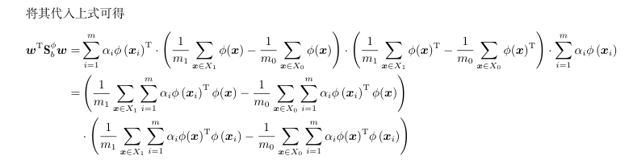

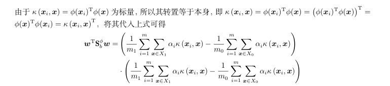

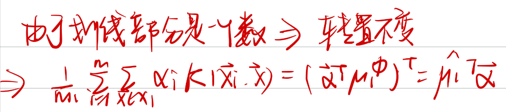

其中

**step4.**分母推导

类间散度矩阵

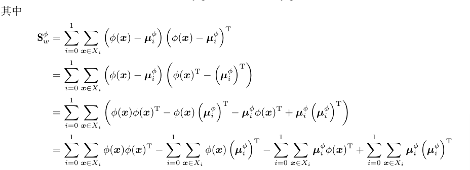

- 第一项

  

- 第二项

  

- 第三项

  

  

其中，

$\Rightarrow$ 目标式化为

==。。看看3.4。。==

#### 核对数几率回归

写成如下形式

-  λ ：调整正则项权重的正则化常数

设 $z_i = \phi(\vec{x_i})$ 是由原始空间经核函数映射到高维空间的特征向量，则

$$
\min_{\vec{w},b}\frac{1}{m}\sum_{i=1}^{m}\log(1+e^{-y_i(\vec{w}^Tz_i+b)})+\frac{\lambda}{2m}||\vec{w}||^2
$$
==??==

**注意$\vec{w}$的维数发生了变化**

由表示定理，上面优化问题的解可以表示为

## 集成学习

### 个体与集成

集成学习/多分类器系统/基于委员会的学习：通过构建并结合多个学习器完成学习任务

**一般结构**

产生一组“个体学习器”，用某种策略将他们结合起来

- 同质集成：由相同类型的个体学习器构成（基学习器；基学习算法）
- 异质集成：个体学习器（组件学习器）由不同的学习算法生成，没有基学习算法

**提升泛化性能**

集成学习结果：少数服从多数

个体学习器应至少不差于弱学习器（分类效果略优于随机猜测）

**二分类例子**

$y\in\{-1,+1\}$，真实函数$f$

设基分类器的错误率为$\epsilon$，即对每个分类器

若集成通过简单投票法得到，

假设基分类器的错误率相等，由Hoeffding不等式推集成的错误率：

> T个基分类器，设X为基分类器分类正确的次数，则X~B(T, 1-$\epsilon$)
>
> 设$x_i$为第$i$个分类器分类正确的次数，则$x_i$~B(1,1-$\epsilon$)，$i=1,2,3\dots T$
>
> 有
>
> X~B(T,1-$\epsilon$)
>
> 
>
> 

随集成中个体分类器的个数增多（T），集成的错误率指数率下降，最终趋于零

上面分析的重要假设：**基学习器的误差相互独立**

事实上，个体学习器的**准确率**和**多样性**存在冲突（即使不同模型）

集成学习方法按照**个体学习器的生成方式**可以分为

- 序列化方法：个体学习器之间存在强依赖关系，必须串行生成——Boosting
- 并行化方法：个体学习器之间不存在强依赖关系，可以同时生成——Bagging、随机森林

### Boosting

Boosting： ~可以将弱学习器提升为强学习器的方法~

#### 工作机制：

- 先从初始训练集训练出来一个基学习器
- 根据基学习器的表现调整训练样本的分布，使得之前基学习器做错的样本在后续受到更多关注
- 新的样本分布下训练下一个基学习器
- 重复上述步骤直到训练T个基学习器
- T个基学习器加权结合

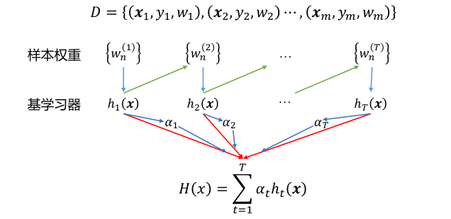

#### 代表算法-AdaBoost

基于加性模型的推导（基学习器的线性组合）：

$H(x)$为连续实值函数

加性模型不采用梯度下降思想

##### 迭代方式

$$
H(x)=\sum_{t=1}^{T-1}\alpha_th_t(x)+\alpha_Th_T(x)
$$

共迭代T次

**最小化指数损失函数**

**指数损失函数**
$$
e^{-f(x)H(x)}
\\f\in\{-1,+1\},H(x)是一个实数
$$
指数损失对噪声敏感

$z=f(x)H(x)$函数间隔

- $ H(x)$ 与$ f(x) $同号，$f(x)H(x) > 0， e^{−f(x)H(x)} = e^{−|H(x)|} < 1$，且$ |H(x)| $越大$ e^{−f(x)H(x) }$越小：
  - $ |H(x)| $大则着分类器本身对预测结果的信心大，损失小；
  - 若$ |H(x)| $在零附近，分类器本身对预测结果信心很小，损失较大；
- $ H(x)$ 与$ f(x) $异号，$f(x)H(x) \lt 0， e^{−f(x)H(x)} = e^{|H(x)|} \gt 1$，且$ |H(x)| $越大$ e^{−f(x)H(x) }$越大：
  - $ |H(x)| $大则着分类器本身对预测结果的信心大，但结果错误，损失应大；
  - 若$ |H(x)| $在零附近，分类器以较小的信息预测错误，损失较小；

**$\mathbb{E}_{x \sim \mathcal{D}}$**

- $\mathcal{D}$ 概率分布：简单理解为在数据集随机抽样，每个样本被抽到的概率
- 整体表示在概率分布$\mathcal{D}$上的期望，简单理解为数据集$D$以概率$\mathcal{D}$加权得到的期望

##### 替代损失一致性

**何时$H(x)$使得指数损失函数最小化？**

于是

令上两式为0，有

（1/2对数几率）$ln\frac{y}{1-y}$

因此，

==7.1节==

(8.8)是(7.6)二分类的特殊形式

$\Rightarrow sign(H(x))$达到贝叶斯最优错误率

即：**指数损失函数最小化时，分类错误率也最小化**

- 替代损失一致性：求解替代损失函数得到的仍是原问题的解

而错误率实际上对应了**0/1损失函数**（非凸，非连续）

由此：

**指数损失函数是分类任务原本 0/1 损失函数的一致的替代损失函数**

而指数损失函数有更好的数学性质，例如它是连续可微函数

因此可以以**指数损失函数**作为优化目标

##### 算法

##### 算法分析

初始分布得到$h_1$，迭代生成$h_t,\alpha_t$

$h_t$在$\mathcal{D}$得到

$\alpha_t$由$h_t$得到

###### $\alpha_t$

$\alpha_t$由$h_t$得到，满足：
$\alpha_th_t$使得指数损失函数最小化，直观想到的的是最小化

==事实上，==，证明在下面

也就是算法中权重的更新公式

- 最小化等价性的证明

###### $h_t$

- 算法希望：

  获得$H_{t-1}$之后调整样本分布，使得$h_t$可以纠正$H_{t-1}$的一些错误（理想情况下纠正所有错误）

  基于此，应该最小化

  

  ==tips==*这里原论文似乎是最小化（对任意$\alpha\gt 0$）*

  

  *课本相当于指定$\alpha=1$，不影响后续结果*

  ==go on==

  

  

  

  

  **上式自变量为$h(x)$（$H_{t-1}$是已知的，因此）**

  于是等价于一个最大化问题

  

  令$\mathcal{D_t}$表示一个分布

  

  又有

  

  其中由（8.15）

  

  于是

  

  即

  

  

  于是

  

  

  $\Rightarrow$理想的$h_t$应在分布$\mathcal{D_t}$下最小化分类错误率

  即算法中的，要求分类误差小于1/2

****

==PPT==

$\alpha \gt 0$，最小化$h_t(x)$等价于最小化==加权损失和==（**$\bar{w_t}$和不为1**）

希望权重不要显示出现：

###### 更新分布

- 考虑$\mathcal{D}_t$和$\mathcal{D}_{t+1}$的关系

  类比(8.15)

  

#### 总结

重赋权法/重采样法

Boosting算法需要在训练的每一轮要检查当前生成的基学习器是否比随即猜测好，不满足则停止学习过程

若基学习器不接受带权重样本-重采样法-根据样本分布重新采样：可能获得重启动机会避免训练过程过早停止；抛弃不满足条件的当前基学习器，根据当前分布重新对样本进行采样，基于新的采样结果重新训练

从偏差-方差分解的角度看，Boosting主要关注降低**偏差**，（更好的拟合），可以基于泛化性能差的学习器构建出很强的集成；但方差可能变大（如对不同数据集分布输出不同）。

- 偏差：预测均值与真实值的差

**限制**：分类问题，指数损失

#### 梯度提升树 Gradient Boosting GDBT

- 使用CART回归树模型
- 基于残差学习，没有样本权重概念

==看PPT吧。。==

容易陷入局部最优

$c_m$为划分值

任意损失，如何确定$w_c$？

### Bagging与随机森林

为了得到泛化能力强的集成，集成中的个体学习器应尽可能相互独立；现实任务中设法使基学习器尽量有较大差异——使用不同的训练样本集，同时所选样本集应保持训练的有效性

#### Bagging

Boostrap AGGregatING

##### 自主采样法

bootstrap sampling

在大小为m的样本集上进行m次有放回的取样

由==（2.1）==知，初始训练集约有63.2%的样本出现在采样集中

##### Bagging算法

得到T个含m个训练样本的采样集，基于每个采样集训练出一个基学习器，再将基学习器结合

结合方法：

- 分类任务使用简单投票法
- 回归任务使用简单平均法

**时间复杂度**

设基学习器的计算复杂度为$O(m)$，采样+投票/平均过程复杂度约为$O(s)$，很小，训练个数$T$是个不太大的常数，因此$T(O(m)+O(s))$与$O(m)$同阶，即**训练一个Bagging集成与直接使用基学习算法训练一个学习器复杂度同阶**

##### 对比AdaBoost

- 标准AdaBoost只适用二分类任务，处理指数损失函数
- Bagging适用多分类、回归等任务，适用任何损失函数

##### 评价

###### 包外估计

因此Bagging的一个优点是：每个基学习器只使用了初始训练集中约63.2%的样本，剩下约36.8%的样本可以用作验证集对泛化性能进行==“包外估计”==（2.2.3）

为此需要记录每个基学习器使用的训练样本

上式对包外的数据用“投票法"选择结果（1或-1）

（此处假设 T 个基分类器的各自的包
外样本的并集一定为训练集 D ）

 T 次独立的随机采样均属于包内的概率为$ 0.632^T$

###### 偏差-方差

从偏差-方差分解角度看，Bagging主要关注降低方差，在*不剪枝决策树、神经网络（==他们容易过拟合==）*等易受样本扰动的学习器上效果更明显

**决策桩/朴素贝叶斯分类器作为bagging的基学习器时，效果较差：**

这两个都是高偏差低方差的模型

- 方差大（偏差低）的模型往往是因为**对训练数据拟合得过好，模型比较复杂**，输入数据的一点点变动都会导致输出结果有较大的差异，它描述的是模型输出的预测值相比于真实值的离散程度，方差越大，越离散，所以为什么Bagging适合以不剪枝决策树、神经网络这些**容易过拟合**的模型为基学习器；
- 偏差大（方差低）的模型则相反，往往因为**对训练数据拟合得不够**，**模型比较简单**，输入数据发生变化并不会导致输出结果有多大改变，它描述的是预测值和和真实值直接的差距，偏差越大，越偏离真实值。

#### 随机森林

是Bagging的一个扩展变体，在以决策树为基学习器构建Bagging集成的基础上，进一步在决策树的训练中引入随机属性选择。

- 传统决策树：在当前结点的属性集合（假设有d个）选择一个最优属性

- RF

  1. 对基决策树的每个结点，先从结点的属性集合中随机选择一个包含k个属性的子集
  2. 从子集中选择一个最优属性用于划分

  **参数k**：控制随机性的引入程度

  - 若k=d，即为传统决策树
  - 若k=1，即为随机选择属性
  - 推荐值$k=log_ad$

##### 对比Bagging

- Bagging的多样性仅来自于样本扰动（采样）

- 随机森林中的基学习器的多样性来自**样本扰动**和**自属性扰动**

- 收敛性类似

  - 随机森林的起始性能往往较差（包含基学习器少，属性扰动降低性能）

  - 随机森林的训练效率常优于Bagging

    因为选择属性时不再需要考察结点的**所有属性**，只需要考察**一个属性子集**

### 结合策略

#### 学习器结合优点

- 统计方面：学习任务的假设空间很大，可能存在多个在训练集上达到同等性能的假设，单学习器容易误选导致泛化性能不佳，结合多学习器降低误该风险
- 计算方面：学习算法往往陷入局部极小（可能泛化性能很糟），多次运行结合可以降低陷入糟糕局部极小点的风险
- 表示方面：学习任务的真实假设可能不在当前考虑的假设空间中，单学习器无效；多学习器结合使得相应的假设空间有所扩大，学得更好的近似

#### 平均法

- 简单平均法

  

- 加权平均法

  

  

  集成学习中的各种结合方法都可视为其特例或变体（变化在于**如何确认权重**）

****

**加权平均未必优于简单平均**

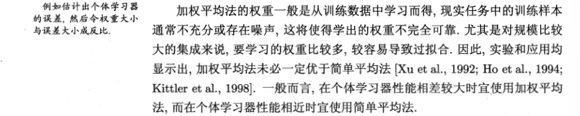

#### 投票法

若学习任务要求必须提供结果，则绝对多数投票退化为相对多数投票。

****

****

****

虽然分类器估计出的类概率一般不太准，但基于类概率进行结合往往**优于**直接基于类标记进行比较的性能

**注意事项**

- 不同类型的$h_i^j(x)$不能混用

- 若预测类别的同时输出分类置信度，分类置信度可以转化为类概率使用

  但需要**规范化**处理，如：

  - 支持向量机的分类间隔值必须使用如Patt缩放等进行校准才能作为类概率

- 不同类型的学习器类概率值不能直接比较，通常可将类概率输出转化为类标记输出（如类概率最大的类设为1）

#### 学习法

通过另一个学习器（次级学习器/元学习器）进行结合

个体学习器：初级学习器

典型代表：**Stacking**

##### Stacking

**算法过程**

1. 从初始训练集训练出初级学习器（同质/异质）

2. 生成一个新数据集用于训练次级学习器

   若直接使用初级学习器的训练集来产生次级训练集，过拟合风险较大

   一般采用**交叉验证**或**留一法**，用初级学习器未使用的样本生成次级学习器的训练样本

   **eg. $k$折交叉验证**中生成训练样本的方法

   >  初始训练集随机划分为$k$个大小相似的集合$D_1\dots D_k$
   >
   > $D_j$表示第$j$折的测试集
   >
   > $\tilde{D_j}=D- D_j$表示第$j$折的训练集
   >
   > 
   >
   > $h_t^j$的训练没有用到$D_j$中样本，用T个不同方法得到T个这样的学习器，他们共同生成一个基于$D_j$中样本$x_i$的新样本
   >
   > 也就是说：**对于$D$中的某个样本，考虑所有没有用这个样本训练的T个学习器（他们属于同一折），这些学习器共同生成该样本对应的新样本，最后得到的新的训练集大小与D相同**
   >
   > 每一折对进行上述操作，
   >
   > 

==？交叉验证这里有点晕==

#### 贝叶斯模型平均（BMA）

### 多样性

#### 误差-分歧分解

- 个体学习器$h_i$的分歧

  

  描绘**多样性**

- 集成的分歧

  

  各个个体学习器的“分歧”加权平均的结果

- 个体学习器的平方误差

  

  个体学习器与真实值之间差值的平方，描绘**准确率**

- 集成的平方误差

  

（8.31）

$\Rightarrow$对某个示例$x$有：**个体学习器分歧的加权均值=个体学习器误差的加权均值-集成的平方误差**

上有：

- 个体在全样本上的分歧
- 集成在全样本上的分歧

即是（8.31）结论用到全样本上的结果

- 个体学习器在全样本上的泛化误差（准确率）

  

- 个体学习器在全样本上的分歧项（多样性）

  

  （连续情形）

  离散情形：

- 集成的泛化误差

  

（8.33）~（8.35）带入（3.32）

表示个体学习器泛化误差的加权均值

表示个体学习器加权分歧值

则有

==**误差-分歧分解**==

集成的泛化误差=个体分析器加权泛化误差-个体分析器加权分歧值

——**个体准确率（泛化误差）越高、多样性（分歧值）越好，集成越好**

*上面推导只适用于回归学习，难以直接推广到分类学习任务上*

#### 多样性度量

估算个体学习器的多样化程度

典型做法：**考虑个体分类器两两相似/不相似性**

##### 成对型多样性度量

若分类器在D上完全一致，则$\mathcal{K}=1$（不希望）

若偶然一致，则$\mathcal{K}=0$

$\mathcal{K}$通常非负，仅在达成一致的概率低于偶然性时取负

##### $\mathcal{K}$-误差图

每一对分类器作为一个点

横坐标：$\mathcal{K}$

纵坐标：平均误差

- 点云越高，误差越大，个体分类器准确性越低
- 点云越靠右，个体学习器多样性越小

#### 多样性增强

引入随机性——对数据样本、输入属性、输出表示、算法参数进行扰动

##### 数据样本扰动

采样法

e.g. 

Bagging：自助采样

AdaBoost：序列采样

- 对不稳定基学习器很有效，如：决策树、神经网络
- 稳定基学习器对样本扰动不敏感，如：线性学习器、支持向量机、朴素贝叶斯、k近邻学习器

##### 输入属性扰动

样本的属性子集视为**子空间**，不同属性子集提供观察数据的不同视角

**随机子空间算法**

**适用情况**：包含大量冗余属性的数据

- 在子空间中训练可以产生多样性大的个体
- 属性减少节省时间
- 减少一些冗余属性不会大幅降低训练效果

##### 输出表示扰动

**翻转法**：随即改变一些样本的标记

**输出调制法**：将分类输出转化为回归输出再构建个体学习器

**ECOC法：**将原任务拆解为多个可同时求解的子任务（利用纠错输出码将多分类拆为一系列二分类任务来训练基学习器）

##### 算法参数扰动

- 随即设置不同参数

  负相关法：正则化项

- 参数较少的算法：替换某些环节

- 单一学习器时用交叉验证等方法确定最终参数

## 聚类

预先标签未知

聚类过程自动生成不相交的簇

### 性能度量

聚类目标：同一簇样本尽可能相似，不同簇样本尽可能不同

- 外部指标：与参考模型比较

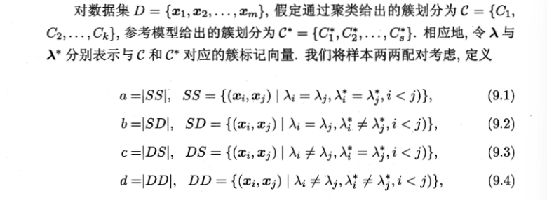

$SS$：$\mathcal{C}$中同簇，$\mathcal{C}^*$中同簇

$SD$：$\mathcal{C}$同簇，$\mathcal{C}^*$不同簇

**常用外部指标**——[0,1] 越大越好

- Jaccard系数（JC）

  

- FM指数（FMI）

  

- Rand指数（RI）

  

**常用内部度量**

定义

- C内两两之间平均距离

  

- C内样本间最远距离

  

- 簇i、j间最小样本距离

  

- 簇i、j中心距离

  

内部指标：

- DB指数（DBI）

  

  越小越好

- Dunn指数（DI）

  

  越大越好

### 距离计算

#### 距离度量的性质

（传递性也即三角不等式）

但用于相似度度量的距离未必一定满足上面四个性质

如：

- 余弦距离不满足传递性

#### 常用距离

##### 闵可夫斯基距离

- p=2

  

##### 离散属性

- 可比较：用数值表示相对大小

- 不可比较：无法计算距离

  采用**VDM**处理无序属性

  

##### 混合属性

##### 加权距离

### 原型聚类

原型：样本空间中具有代表性的点

#### k均值算法

样本集$D=\{x_1,x_2,\dots,x_m\}$

簇划分$\mathcal{C}=\{C_1,C_2,\dots,C_k\}$

最小化平方误差

上式一定程度上刻画了簇内样本围绕簇均值向量的紧密程度，E越小则簇样本的相似度越高

采用贪心策略

优化问题：
$$
\min_{T,\mu}E(T,\mu)=||X-T\mu||_F^2
$$

**step.1**

**step.2**

==ppt这里没看懂==

#### 学习向量量化(LVQ)

假设数据样本带有类别标记

m个样本，n维特征

**学习目标**

一组n维原型向量$\{\vec{p}_1,\vec{p}_2,\dots,\vec{p}_q\}$，每个原型向量代表一个聚类簇

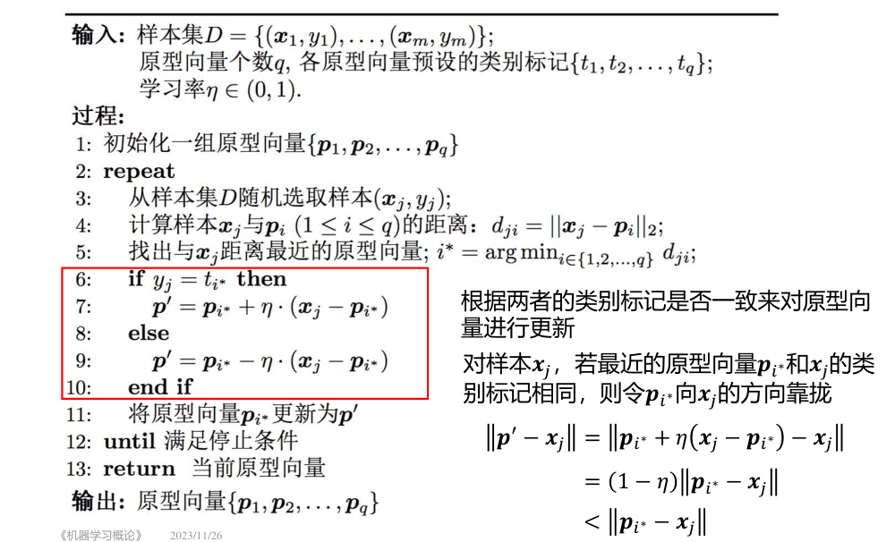

- 初始化：可以从相应类别标记的样本中随机选取一个作为原型向量

**训练结果**

每个原型向量$p_i$定义了与之相关的一个区域$R_i$，该区域内每个样本满足：$p_i$是距离样本最近的原型向量

即：

#### 高斯混合聚类

**概率模型**

高斯混合分布

由k个混合成分组成，每个混合成分对应一个高斯分布

$\alpha_i\gt 0$：混合系数，和为1

- 训练样本生成

  根据混合系数定义的先验分布选择高斯混合成分（以混合系数作为概率）

- 生成训练集$D=\{x_1,x_2,\dots,x_m\}$，对于给定样本$x_j$，它由哪个高斯混合成分生成？

  ——求后验概率$p_\mathcal{M}(z_j=i|x_i)$

  由贝叶斯公式：

  

  即

- 确定样本簇标记（在训练模型之后）

  $x_j$簇标记$\lambda_j= \arg \max_{i\in\{1,2,\dots,k\}}\gamma_{ji}$

  即使得后验概率最大

  

- 求模型参数

  最大化对数似然估计

  

  **解释**

  训练集D中既然出现了$x_j$，则希望求解的参数使得这种可能性$p_{\mathcal{M}}(x_j)$最大；

  假设m个样本相互独立，则他们恰好一起出现的概率是$\Pi_{j=1}^m p_{\mathcal{M}}(x_j)$，**即为似然函数**

  为了防止连乘下溢，采用对数似然

- **EM算法（期望最大化算法）迭代优化**

  

  此前有

  

  因此

  

  

  $\Rightarrow$混成成分均值可以用样本的加权平均估计，样本权重是样本属于这个成分的后验概率

  同理可得

- 拉格朗日求混合系数

  **增加$\sum {\alpha_i}=1$**约束条件，得到拉格朗日形式

  

  ==勘误：（9.38）上一行，改为 对所有混合成分求和==

==**EM算法总结**==

1. E：根据当前参数计算每个样本属于每个高斯成分的后验概率
2. M：更新模型参数，最小化似然函数

### 密度聚类

假设聚类结构可以根据样本分布的紧密程度确定

从样本密度角度考虑样本之间的可连接性，基于可连接样本不断扩展聚类簇以获得最终的聚类结果

#### DBSCAN算法

##### 定义

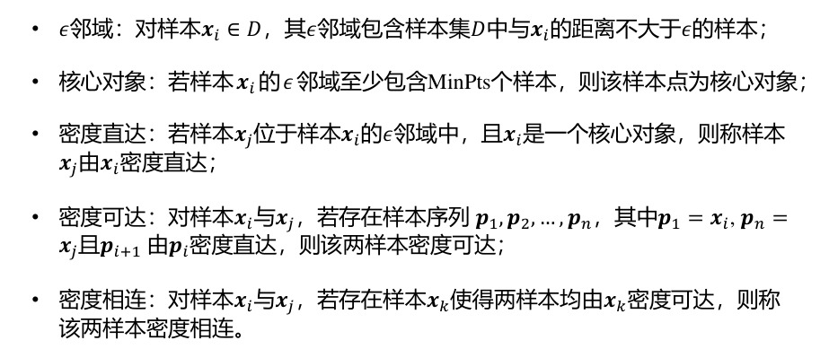

**簇**：由**密度可达**关系导出的最大密度相连样本集合

即满足**连接性、最大性**的非空样本子集

*$x_i$由核心对象密度可达$\Rightarrow x_j$由核心对象密度可达$\Rightarrow x_i、x_j$密度相连*

**最大性不会违反连接性**

##### 算法

**内层while循环一轮生成一个聚类簇**

1. 找出所有核心对象，任选一个核心对象作为种子
2. 找核心对象密度可达的样本生成聚类簇

==看书上例子==

### 层次聚类

在不同层次对数据集划分，形成树形的聚类结构

#### AGNES——自底向上

从单个样本为簇开始，每次选择距离最近的簇合并

集合间距离：

分别对应**单链接、全链接、均链接**算法

**流程**

1. 初始化
2. 合并最近的
3. 更新距离矩阵

### 降维与度量学习

**关于考试**

*度量没考过，降维PCA一般会考*

*chap13 半监督学习不考*

kNN k近邻

MDS 多维缩放

PCA 主成分分析/线性降维

KPCA 核化线性降维

Isomap 等度量映射

LLE 局部线性嵌入

NCA 近邻成分分析

LVW 包裹式特征选择

PGD 近端梯度下降

RIP 限定等距性
